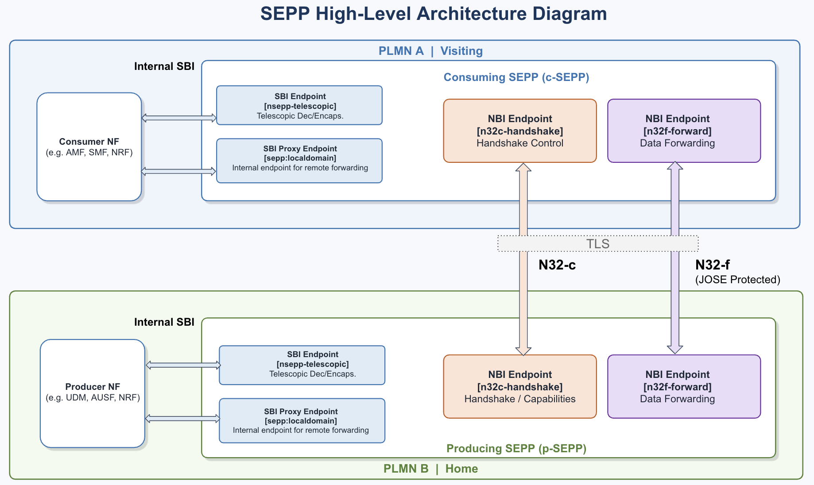
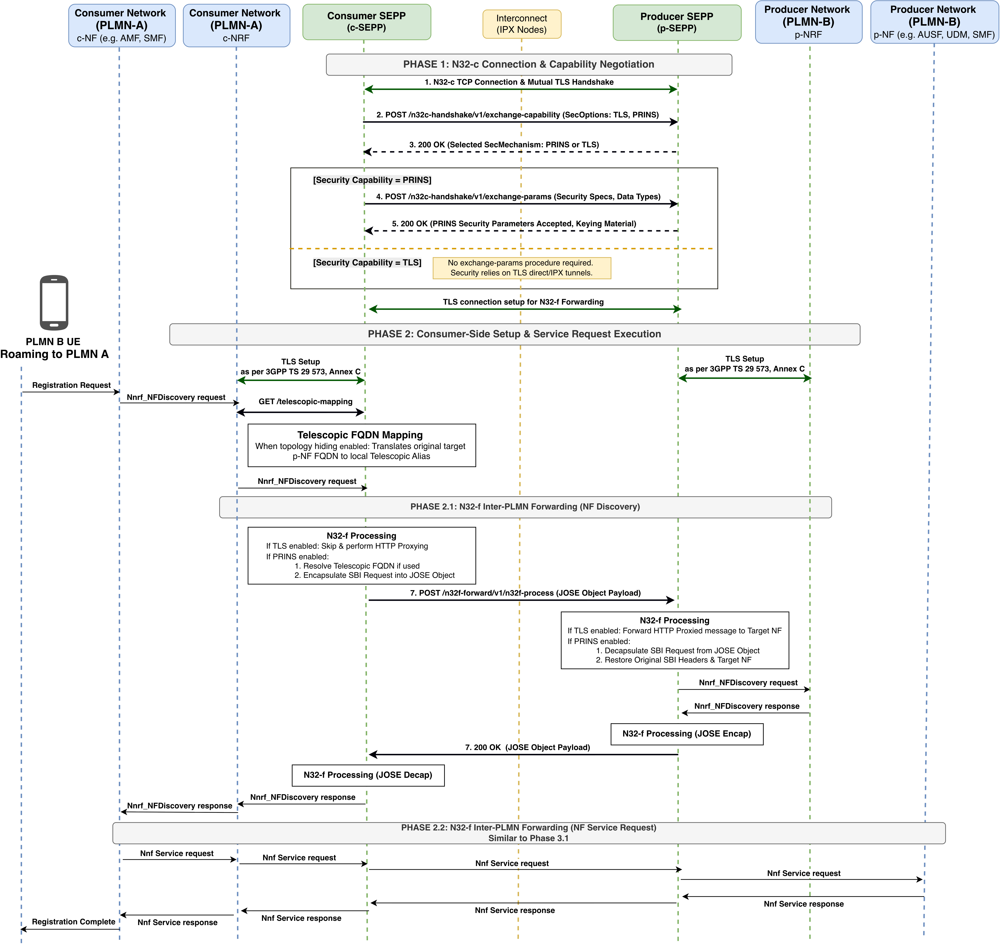

<!-- SPDX-License-Identifier: CC-BY-4.0 -->

<table style="border-collapse: collapse; border: none;">
  <tr style="border-collapse: collapse; border: none;">
    <td style="border-collapse: collapse; border: none;">
      <a href="http://www.openairinterface.org/">
         
         </img>
      </a>
    </td>
    <td style="border-collapse: collapse; border: none; vertical-align: center;">
      <b>OpenAirInterface SEPP Feature Set</b>
    </td>
  </tr>
</table>

**Table of Contents**

1. [OAI SEPP Feature List](#1-oai-sepp-feature-list)
2. [OAI SEPP Available Interfaces](#2-oai-sepp-available-interfaces)
3. [OAI SEPP High-level Architecture](#3-oai-sepp-high-level-architecture)
4. [OAI SEPP High-level JOSE Protected Call Flow](#4-oai-sepp-high-level-call-flow)
5. [OAI SEPP Test Coverage Status](#5-oai-sepp-test-coverage-status)

# 1. OAI SEPP Feature List #

Based on specification **3GPP TS 29.573, R19.7.0**

| **ID** | **Classification**                                                   | **Status**         | **Comments**                |
|--------|----------------------------------------------------------------------|--------------------|-----------------------------|
| 1      | Message filtering and policing on inter-PLMN control plane interfaces| ✅                 |                             |
| 1.1    | - Security Capability : TLS                                          | ✅                 |                             |
| 1.2    | - Security Capability : PRINS                                        | ✅                 |                             |
| 1.3    | - Support of Roaming Intermediatory                                  | ❌                 | In Progress                 |
| 2      | Topology hiding                                                      | ✅                 |                             |
| 2.1    | - Using telescopic fqdn mapping                                      | ✅                 |                             |
| 2.2    | - Using 3gpp-Sbi-Target-apiRoot                                      | ✅                 |                             |

# 2. OAI SEPP Available Interfaces #

| **ID** | **Interface** | **Status**         | **Comment**             |
|--------|---------------|--------------------|-------------------------|
| 1      | N32-c         |✅                  | between hSEPP and vSEPP |
| 2      | N32-f         |✅                  | between hSEPP and vSEPP |
| 3      | SBI           |✅                  | between hNF and hSEPP   |

#### Support HTTP/2 for SBI/NBI (N32) 
#### Support TLS 1.3 over NBI (N32)

# 3. OAI SEPP High-level Architecture #

# 4. OAI SEPP High-level Call Flow #

# 5. OAI SEPP Test Coverage Status #

End to end scenario support based on 3GPP TS 29 573, R 19.7.0, Annex C						
						
| Scenario | NF ↔ SEPP | N32-f Security | Telescopic FQDN | Target-apiRoot | JOSE/PRINS | OAI Test Status |
|---|---|---|---|---|---|---|
| C.2.1.2 | HTTP | TLS | No | No | No | ✅ |
| C.2.1.3 | HTTP | TLS | No | Yes | No | ✅ |
| C.2.2.2 | HTTPS | TLS | Yes | No | No | ❌ |
| C.2.2.3 | HTTPS | TLS | No | No | No | ❌ |
| C.2.2.4 | HTTPS | TLS | Yes | Yes | No | ❌ |
| C.2.2.5 | HTTPS | TLS | No | Yes | No | ❌ |
| C.3.1 | HTTP | PRINS | No | No | Yes | ✅ |
| C.3.2.2 | HTTPS | PRINS | Yes | No | Yes | ❌ |
| C.3.2.3 | HTTPS | PRINS | No | No | Yes | ❌ |
