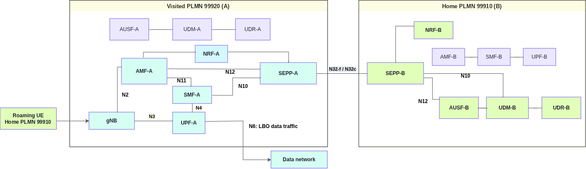

# End-to-end 5G SA LBO Roaming with OAI 5G Core Network

In this tutorial, a UE from the **home PLMN 99910** connects to the **visited PLMN 99920** using **Local Breakout (LBO) roaming**. The tutorial covers the **5G roaming signalling and user-plane procedures** for establishing an LBO connection. This includes **inter-PLMN communication via the SEPP**, UE authentication and subscriber information retrieval from the home network, and **PDU session establishment in the visited network**.




## 1. Prerequisites: build the images

Build required images by running `build_images.sh` from the SEPP repository:

```bash
cd scripts/test
./build_images.sh
```

The script builds all core NFs first, then UERANSIM.

| Component | Branch | Image tag |
|---|---|---|
| AMF, SMF, NRF, UDM, UDR | `lbo-roaming-support` | `oai-<nf>:roaming-lbo` |
| AUSF, UPF | `develop` | `oai-<nf>:roaming-lbo` |
| SEPP | Repository default | `oai-sepp:roaming-lbo` |
| UERANSIM | Repository default | `ueransim:roaming-lbo` |

Core NF sources are from [OpenAirInterface](https://github.com/openairinterface). SEPP uses this checkout's origin repository. UERANSIM uses [rohanrkharade/UERANSIM](https://github.com/rohanrkharade/UERANSIM). Set `SEPP_BRANCH=master` if that branch is required.

The SEPP is built on Ubuntu 24.04 (`BASE_IMAGE_SEPP`, default `ubuntu:noble`); its build scripts reject 22.04.

## 2. Start both networks

From `scripts/test`:

```bash
docker compose -f docker-compose-basic-nrf-lbo-roaming.yaml up -d
python3 align_sepp_interfaces.py
docker compose -f docker-compose-basic-nrf-lbo-roaming.yaml ps
```

Use `docker-compose` instead if the host has Compose v1.

| Test setting | Value |
|---|---|
| UE | `imsi-999100000000031` |
| Home → visited PLMN | `99910` → `99920` |
| DNN | `oai` |
| Slice | SST `222`, SD `00007B` |

Network settings are in `conf/roaming_config_partnerA.yaml` and `conf/roaming_config_partnerB.yaml`. The UE uses `conf/ueransim/ue-plmnB.yaml`. Existing database volumes are preserved.

## 3. Run and verify

The UE automatically registers, establishes its PDU session, and performs the LBO data traffic test.

```bash
docker logs -f ue-plmnB-roaming-A
docker exec ue-plmnB-roaming-A nr-cli imsi-999100000000031 -e status
docker exec ue-plmnB-roaming-A nr-cli imsi-999100000000031 -e ps-list
```

Confirm successful registration, an active IPv4 session on `oai`, and successful data traffic through the visited UPF.

## 4. Logs and LBO test capture


Selected excerpts from the same run follow:-

**LBO data traffic — UE ping**

```text
PING google.com (74.125.143.102) from 12.1.1.130 uesimtun0: 56(84) bytes of data.
64 bytes from 74.125.143.102: icmp_seq=1 ttl=108 time=23.2 ms
64 bytes from 74.125.143.102: icmp_seq=2 ttl=108 time=21.5 ms
64 bytes from 74.125.143.102: icmp_seq=3 ttl=108 time=22.8 ms
--- google.com ping statistics ---
3 packets transmitted, 3 received, 0% packet loss, time 2002ms
rtt min/avg/max/mdev = 21.459/22.506/23.244/0.761 ms
```

**Visited AMF-A Logs**

```text
2026-09-22T19:04:33.842303392Z    |------------------------------------------------------------------------------------------------------------------------------------------------------------|
2026-09-22T19:04:33.842339059Z    |----------------------------------------------------------------------gNBs' Information---------------------------------------------------------------------|
2026-09-22T19:04:33.842357434Z    |  Index |               Status               |              Global Id             |              gNB Name              |                PLMN                |
2026-09-22T19:04:33.842373479Z    |    1   |              Connected             |                0x01                |        UERANSIM-gnb-999-20-1       |               999,20               |
2026-09-22T19:04:33.842389361Z    |------------------------------------------------------------------------------------------------------------------------------------------------------------|
2026-09-22T19:04:33.842401792Z 
2026-09-22T19:04:33.842415043Z    |-----------------------------------------------------------------------------------------------------------------------------------------------------------|
2026-09-22T19:04:33.842431389Z    |---------------------------------------------------------------------UEs' Information----------------------------------------------------------------------|
2026-09-22T19:04:33.842492661Z    |  Index |     5GMM State     |                IMSI/SUPI               |        GUTI        |   RAN UE NGAP ID   |   AMF UE NGAP ID   |        PLMN        |       Cell Id      |
2026-09-22T19:04:33.842509613Z    |    1   |   5GMM-REGISTERED  |             999100000000031            |99920010041135736812|        0x01        |        0x01        |       999,20       |      000000010     |
2026-09-22T19:04:33.842525947Z    |-----------------------------------------------------------------------------------------------------------------------------------------------------------|
2026-09-22T19:04:33.842541864Z 
2026-09-22T19:04:34.012216720Z [2026-09-22 21:04:34.011] [amf_sbi] [info] Receive Update NF Instance Request, handling ...
2026-09-22T19:04:34.012827296Z [2026-09-22 21:04:34.011] [amf_sbi] [debug] Send NF Update to NRF
2026-09-22T19:04:34.012858922Z [2026-09-22 21:04:34.011] [amf_sbi] [info] Send HTTP message to http://nrf.5gc.mnc20.mcc999.3gppnetwork.org:8080/nnrf-nfm/v1/nf-instances/ddbe5a7d-ff38-4bb0-86c5-3e175ece11b1
```
**Home AUSF-B Logs**

```text
2026-09-22T19:04:29.961611423Z [2026-09-22 21:04:29.961] [ausf_app] [info] supiOrSuci imsi-999100000000031
2026-09-22T19:04:29.962165836Z [2026-09-22 21:04:29.962] [ausf_app] [debug] UDM's URI http://udm.5gc.mnc10.mcc999.3gppnetwork.org:8080/nudm-ueau/v1/imsi-999100000000031/security-information/generate-auth-data
2026-09-22T19:04:29.962199872Z [2026-09-22 21:04:29.962] [ausf_app] [info] Received authInfo from AMF without ResynchronizationInfo IE
2026-09-22T19:04:29.962223067Z [2026-09-22 21:04:29.962] [ausf_client] [debug] Send a simple HTTP request
2026-09-22T19:04:30.030484993Z [2026-09-22 21:04:30.030] [ausf_app] [info] Response from UDM: {"authType":"5G_AKA","authenticationVector":{"autn":"47fcb6860ffc80000f5ef499dea02321","avType":"5G_HE_AKA","kausf":"ff57436fbecde9e4dc84feec9cfedcfd3e91f96fa8e401a338bf9f20aecfdc4d","rand":"afd717e98be059474e4ea96e7de26a34","xresStar":"b8a5c6820f8ed1ed490cfd2c67414373"},"supi":"imsi-999100000000031"}
2026-09-22T19:04:30.030748091Z [2026-09-22 21:04:30.030] [ausf_app] [debug] authType 5G_AKA
2026-09-22T19:04:30.030778248Z [2026-09-22 21:04:30.030] [ausf_app] [debug] autn_udm 47fcb6860ffc80000f5ef499dea02321
2026-09-22T19:04:30.030789116Z [2026-09-22 21:04:30.030] [ausf_app] [debug] av_type_udm 5G_HE_AKA
2026-09-22T19:04:30.030797465Z [2026-09-22 21:04:30.030] [ausf_app] [debug] kausf_udm ff57436fbecde9e4dc84feec9cfedcfd3e91f96fa8e401a338bf9f20aecfdc4d
2026-09-22T19:04:30.030806073Z [2026-09-22 21:04:30.030] [ausf_app] [debug] rand_udm afd717e98be059474e4ea96e7de26a34
2026-09-22T19:04:30.030813949Z [2026-09-22 21:04:30.030] [ausf_app] [debug] xres*_udm b8a5c6820f8ed1ed490cfd2c67414373
2026-09-22T19:04:30.030821896Z [2026-09-22 21:04:30.030] [ausf_app] [debug] Generating 5G AV
2026-09-22T19:04:30.030829639Z [2026-09-22 21:04:30.030] [ausf_app] [debug] HXresStar calculated:
2026-09-22T19:04:30.030837533Z  a41e72e8a89f2014b98376a8c08cd7c4
2026-09-22T19:04:30.030845189Z [2026-09-22 21:04:30.030] [ausf_app] [debug] Derive_kseaf ...
2026-09-22T19:04:30.030852733Z [2026-09-22 21:04:30.030] [ausf_app] [debug] SNN: 5G:mnc020.mcc999.3gppnetwork.org
2026-09-22T19:04:30.030860559Z [2026-09-22 21:04:30.030] [common] [debug] [ausf_app]derive_kseaf Kausf
2026-09-22T19:04:30.030883673Z ff 57 43 6f be cd e9 e4 dc 84 fe ec 9c fe dc fd 3e 91 f9 6f a8 e4 01 a3 38 bf 9f 20 ae cf dc 4d 
2026-09-22T19:04:30.030892969Z [2026-09-22 21:04:30.030] [common] [debug] [ausf_app]derive_kseaf Kseaf
2026-09-22T19:04:30.030900757Z a9 73 de a0 2b 5a 4b 70 1f 88 0b ee aa bf 6d c9 5f 6e 61 96 5d 98 d8 87 99 60 35 d5 d8 ef 9b 14 
2026-09-22T19:04:30.030908576Z [2026-09-22 21:04:30.030] [ausf_app] [debug] Kseaf calculated:
2026-09-22T19:04:30.030916107Z  a973dea02b5a4b701f880beeaabf6dc95f6e61965d98d887996035d5d8ef9b14
2026-09-22T19:04:30.030923761Z [2026-09-22 21:04:30.030] [ausf_app] [debug] Create a new security context with SUPI imsi-999100000000031
2026-09-22T19:04:30.031068768Z [2026-09-22 21:04:30.030] [ausf_app] [debug] Auth Response:
2026-09-22T19:04:30.031100889Z  {"5gAuthData":{"autn":"47fcb6860ffc80000f5ef499dea02321","hxresStar":"a41e72e8a89f2014b98376a8c08cd7c4","rand":"afd717e98be059474e4ea96e7de26a34"},"_links":{"5g-aka":{"href":"http://192.168.73.133:8080/nausf-auth/v1/ue-authentications/47fcb6860ffc80000f5ef499dea02321/5g-aka-confirmation"}},"authType":"5G_AKA"}
2026-09-22T19:04:30.031656252Z [2026-09-22 21:04:30.031] [ausf_server] [debug] Auth response:
2026-09-22T19:04:30.031708741Z  {"5gAuthData":{"autn":"47fcb6860ffc80000f5ef499dea02321","hxresStar":"a41e72e8a89f2014b98376a8c08cd7c4","rand":"afd717e98be059474e4ea96e7de26a34"},"_links":{"5g-aka":{"href":"http://192.168.73.133:8080/nausf-auth/v1/ue-authentications/47fcb6860ffc80000f5ef499dea02321/5g-aka-confirmation"}},"authType":"5G_AKA"}
2026-09-22T19:04:30.031734058Z [2026-09-22 21:04:30.031] [ausf_server] [info] Send Auth response to SEAF (Code 201)
2026-09-22T19:04:30.050535840Z [2026-09-22 21:04:30.049] [ausf_server] [info] Received 5g_aka_confirmation Request
2026-09-22T19:04:30.050600265Z [2026-09-22 21:04:30.049] [ausf_server] [info] 5gaka confirmation received with authctxID 47fcb6860ffc80000f5ef499dea02321
2026-09-22T19:04:30.050621675Z [2026-09-22 21:04:30.049] [ausf_app] [debug] Handling 5g-aka-confirmation
2026-09-22T19:04:30.050638133Z [2026-09-22 21:04:30.049] [ausf_app] [debug] Retrieve security context with authCtxId: 47fcb6860ffc80000f5ef499dea02321
2026-09-22T19:04:30.050653244Z [2026-09-22 21:04:30.049] [ausf_app] [info] Received authCtxId 47fcb6860ffc80000f5ef499dea02321
2026-09-22T19:04:30.050667761Z [2026-09-22 21:04:30.049] [ausf_app] [info] Received res* B8A5C6820F8ED1ED490CFD2C67414373
2026-09-22T19:04:30.050681928Z [2026-09-22 21:04:30.049] [ausf_app] [debug] authCtxId in AUSF: 47fcb6860ffc80000f5ef499dea02321
2026-09-22T19:04:30.050695929Z [2026-09-22 21:04:30.049] [ausf_app] [info] AV is up to date, handling received res*...
2026-09-22T19:04:30.050708267Z [2026-09-22 21:04:30.049] [ausf_app] [debug] xres* in AUSF: b8a5c6820f8ed1ed490cfd2c67414373
2026-09-22T19:04:30.050721309Z [2026-09-22 21:04:30.049] [ausf_app] [debug] xres in AMF: b8a5c6820f8ed1ed490cfd2c67414373
2026-09-22T19:04:30.050734755Z [2026-09-22 21:04:30.049] [ausf_app] [info] Authentication successful by home network!
2026-09-22T19:04:30.050748962Z [2026-09-22 21:04:30.049] [ausf_app] [debug] UDM's URI: http://udm.5gc.mnc10.mcc999.3gppnetwork.org:8080/nudm-ueau/v1/imsi-999100000000031/auth-events
2026-09-22T19:04:30.050764386Z [2026-09-22 21:04:30.049] [ausf_app] [debug] confirmResultInfo: {"authRemovalInd":false,"authType":"5G_AKA","nfInstanceId":"477e27ed-668e-4233-a520-592ea8e15a26","servingNetworkName":"5G:mnc020.mcc999.3gppnetwork.org","success":true,"timeStamp":"2026-09-22T19:04:30Z"}
2026-09-22T19:04:30.050788678Z [2026-09-22 21:04:30.049] [ausf_client] [debug] Send a simple HTTP request
2026-09-22T19:04:30.065960790Z [2026-09-22 21:04:30.065] [ausf_server] [debug] 5g-aka-confirmation response:
2026-09-22T19:04:30.065985702Z  {"authResult":"AUTHENTICATION_SUCCESS","kseaf":"a973dea02b5a4b701f880beeaabf6dc95f6e61965d98d887996035d5d8ef9b14","supi":"imsi-999100000000031"}
2026-09-22T19:04:30.066016184Z [2026-09-22 21:04:30.065] [ausf_server] [info] Send 5g-aka-confirmation response to SEAF (Code 200)
```

**Visited SMF-A Logs**
```text
2026-09-22T19:04:30.460756756Z [2026-09-22 21:04:30.460] [smf_app] [info] Set upCnxState to UPCNX_STATE_ACTIVATED
2026-09-22T19:04:30.460890339Z [2026-09-22 21:04:30.460] [smf_app] [info] SMF context: 
2026-09-22T19:04:30.460895719Z  
2026-09-22T19:04:30.460898518Z SMF CONTEXT:
2026-09-22T19:04:30.460901220Z SUPI:				imsi-999100000000031
2026-09-22T19:04:30.460904202Z PDU SESSION:				
2026-09-22T19:04:30.460906710Z 	PDU Session ID:			1
2026-09-22T19:04:30.460909630Z 	DNN:			oai
2026-09-22T19:04:30.460912285Z 	S-NSSAI:			sst, sd: 222, 00007b
2026-09-22T19:04:30.460931268Z 	PDN type:		IPV4
2026-09-22T19:04:30.460934379Z 	PAA IPv4:		12.1.1.130
2026-09-22T19:04:30.460936751Z 	Default QFI:		No QFI available
2026-09-22T19:04:30.460939128Z 	SEID:			1
2026-09-22T19:04:30.460941703Z 	N3:
2026-09-22T19:04:30.460944030Z - UPF Graph Edge
2026-09-22T19:04:30.460946533Z   + Interface Type.............................: N3
2026-09-22T19:04:30.460949208Z   + NWI........................................: 
2026-09-22T19:04:30.460951722Z   + Uplink.....................................: No
2026-09-22T19:04:30.460954447Z   + PDR ID.....................................: 1
2026-09-22T19:04:30.460956970Z   + FAR ID.....................................: 2
2026-09-22T19:04:30.460959600Z 
2026-09-22T19:04:30.460961975Z 
2026-09-22T19:04:30.460964452Z [2026-09-22 21:04:30.460] [smf_app] [debug] Send request to N11 to triger FlexCN, SMF Context ID 0x1 
```

**Visited UPF-A Logs**

```text
2026-09-22T19:04:30.407986587Z [2026-09-22 21:04:30.407] [upf_n4 ] [info] pfcp_session::get(fteid) seid 0x1 
2026-09-22T19:04:30.408522539Z [2026-09-22 21:04:30.408] [upf_n4 ] [info] pfcp_session::add(pdr) seid 0x1 
2026-09-22T19:04:30.408536548Z 
2026-09-22T19:04:30.408540983Z +--------------------------------------------------------------------------------------------------------------------------------------------------------------------------------------------------+
2026-09-22T19:04:30.408545188Z | PFCP switch Packet Detection Rule list ordered by established sessions:                                                                                                                          |
2026-09-22T19:04:30.408550008Z +----------------+----+--------+--------+------------+---------------------------------------+----------------------+----------------+-------------------------------------------------------------+
2026-09-22T19:04:30.408553846Z |  SEID          |pdr |  far   |predence|   action   |        create outer hdr         tun id| rmv outer hdr  tun id|    UE IPv4     |                                                             |
2026-09-22T19:04:30.408582022Z +----------------+----+--------+--------+------------+---------------------------------------+----------------------+----------------+-------------------------------------------------------------+
2026-09-22T19:04:30.408587520Z |0000000000000001|0001|00000001|00000000|ACC>---->COR|none                                   |GTPU_UDP_IPV4:00000001|12.1.1.130      |
2026-09-22T19:04:30.408592030Z +--------------------------------------------------------------------------------------------------------------------------------------------------------------------------------+
2026-09-22T19:04:30.408595895Z 
2026-09-22T19:04:30.441821716Z [2026-09-22 21:04:30.441] [upf_n4 ] [info] handle_receive(191 bytes)
2026-09-22T19:04:30.441883210Z [2026-09-22 21:04:30.441] [upf_app] [info] Received N4_SESSION_MODIFICATION_REQUEST seid 0x1 
2026-09-22T19:04:30.441890050Z [2026-09-22 21:04:30.441] [upf_n4 ] [info] pfcp_session::add(far) seid 0x1 
2026-09-22T19:04:30.441912937Z [2026-09-22 21:04:30.441] [upf_n4 ] [info] pfcp_session::add(pdr) seid 0x1 
2026-09-22T19:04:30.441920388Z 
2026-09-22T19:04:30.441924767Z +--------------------------------------------------------------------------------------------------------------------------------------------------------------------------------------------------+
2026-09-22T19:04:30.441927527Z | PFCP switch Packet Detection Rule list ordered by established sessions:                                                                                                                          |
2026-09-22T19:04:30.441929977Z +----------------+----+--------+--------+------------+---------------------------------------+----------------------+----------------+-------------------------------------------------------------+
2026-09-22T19:04:30.441932399Z |  SEID          |pdr |  far   |predence|   action   |        create outer hdr         tun id| rmv outer hdr  tun id|    UE IPv4     |                                                             |
2026-09-22T19:04:30.441934834Z +----------------+----+--------+--------+------------+---------------------------------------+----------------------+----------------+-------------------------------------------------------------+
2026-09-22T19:04:30.441938364Z |0000000000000001|0001|00000001|00000000|ACC>---->COR|none                                   |GTPU_UDP_IPV4:00000001|12.1.1.130      |
2026-09-22T19:04:30.441941100Z |0000000000000001|0002|00000002|00000000|COR>---->ACC|GTPU_UDP_IPV4:192.168.71.140  :00000001|none                  |12.1.1.130      |
2026-09-22T19:04:30.441943688Z +--------------------------------------------------------------------------------------------------------------------------------------------------------------------------------+
2026-09-22T19:04:30.441946176Z 
2026-09-22T19:04:30.495788322Z [2026-09-22 21:04:30.495] [pfcp_switch] [info] PDR/PDI IP is 8201010c 
```


| Artifact | Visited PLMN (A) | Home PLMN (B) |
|---|---|---|
| AMF | [AMF-A](../scripts/test/logs-lbo/oai-amf-A.txt) | [AMF-B](../scripts/test/logs-lbo/oai-amf-B.txt) |
| SMF | [SMF-A](../scripts/test/logs-lbo/oai-smf-A.txt) | [SMF-B](../scripts/test/logs-lbo/oai-smf-B.txt) |
| UPF | [UPF-A](../scripts/test/logs-lbo/oai-upf-A.txt) | [UPF-B](../scripts/test/logs-lbo/oai-upf-B.txt) |
| NRF | [NRF-A](../scripts/test/logs-lbo/oai-nrf-A.txt) | [NRF-B](../scripts/test/logs-lbo/oai-nrf-B.txt) |
| AUSF | [AUSF-A](../scripts/test/logs-lbo/oai-ausf-A.txt) | [AUSF-B](../scripts/test/logs-lbo/oai-ausf-B.txt) |
| UDM | [UDM-A](../scripts/test/logs-lbo/oai-udm-A.txt) | [UDM-B](../scripts/test/logs-lbo/oai-udm-B.txt) |
| UDR | [UDR-A](../scripts/test/logs-lbo/oai-udr-A.txt) | [UDR-B](../scripts/test/logs-lbo/oai-udr-B.txt) |
| SEPP | [SEPP-A](../scripts/test/logs-lbo/oai-sepp-A.txt) | [SEPP-B](../scripts/test/logs-lbo/oai-sepp-B.txt) |
| Roaming UE | [UE log](../scripts/test/logs-lbo/ueransim-vplmnA.txt) | — |
| LBO test PCAP | [Download capture](../scripts/test/logs-lbo/oai-5gc-lbo-roaming.pcap) | Both PLMNs |

[All logs](../scripts/test/logs-lbo/) · [Test details](../scripts/test/logs-lbo/results.json)

To refresh complete logs, wait for AMF-A's periodic table to show `5GMM-REGISTERED` after the traffic test, then run:

```bash
python3 capture_lbo_logs.py --output logs-lbo
```


## 5. Stop

```bash
docker compose -f docker-compose-basic-nrf-lbo-roaming.yaml down
```

## 6. Home-routed roaming

When the home subscription does not allow LBO for the DNN (`lboRoamingAllowed: false`), the same UE gets a **home-routed** PDU session instead: a V-SMF/V-UPF in the visited PLMN, an H-SMF/H-UPF in the home PLMN, N16 through the SEPPs and an N9 tunnel between the UPFs. The UE address then comes from the home pool and traffic breaks out in the home PLMN.

See the [home-routed roaming tutorial](./HR_ROAMING_TEST.md) (`docker-compose-basic-nrf-hr-roaming.yaml`).
